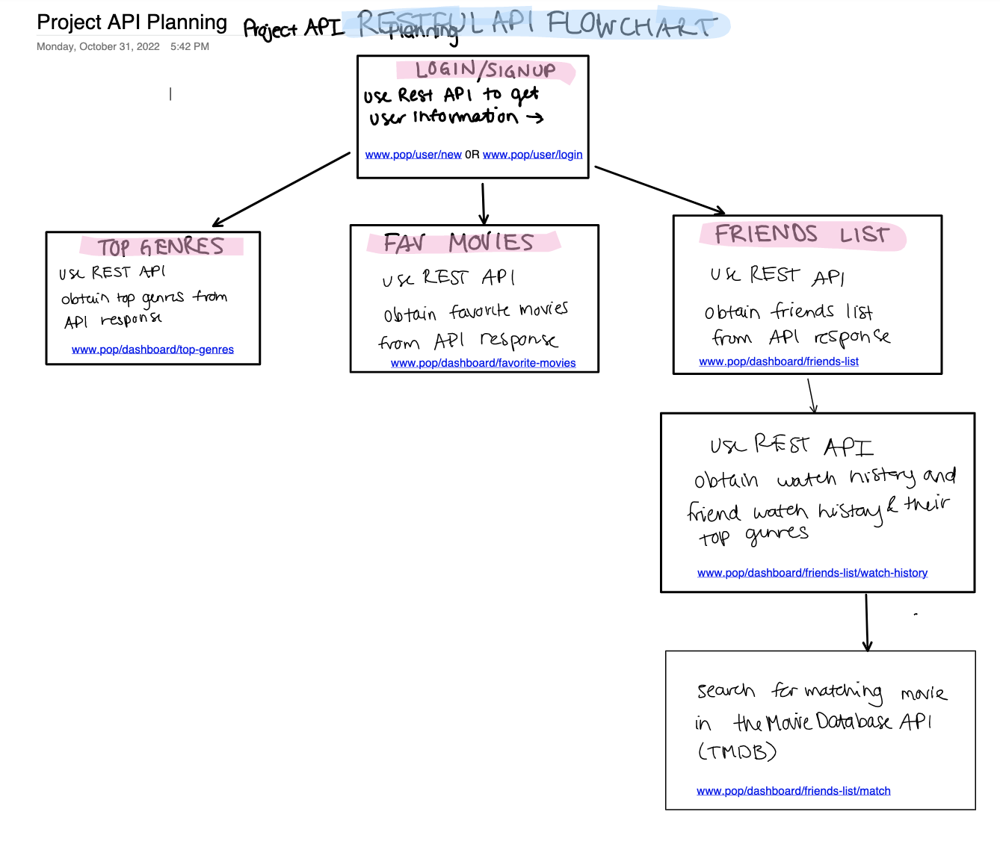
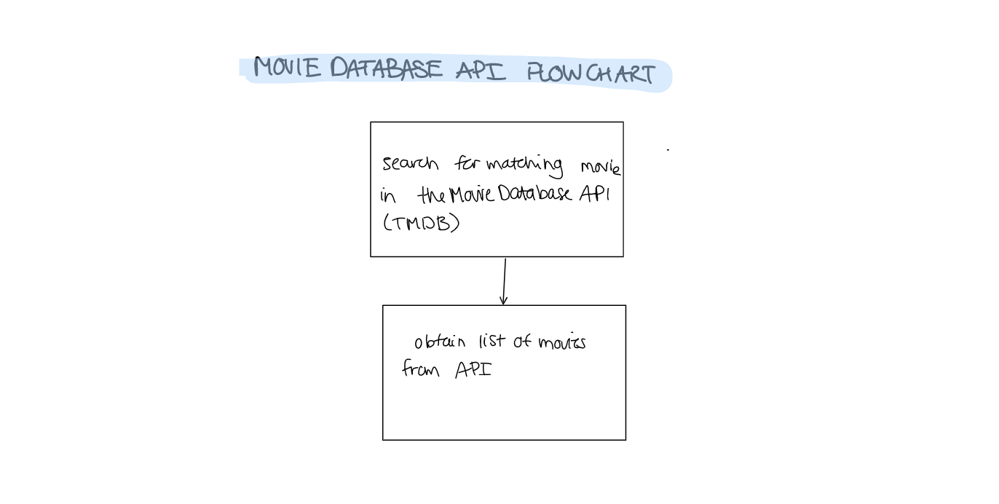

# **MILESTONE 2**

## **Data Interactions**

* User can create profile with profile picture and their watch history and their top genres
* User can add friends and view their friends list
* User can choose a friend to create a blended list of movie suggestions from The Movie Database (https://developers.themoviedb.org/3/getting-started/introduction) based on their watch histories and chosen genre.
* User can favorite movies that they would like to watch within the blended list and view the list again from the friends list

## **Division of Labor**

Foram Patel

* Drew API Flow Chart 
* Login Page
* Dashboard
* Server Set Up

Tengfei Louie

* Navigation Bar
* Account Settings
* Confirmation Page

Vivienne Tam

* Wrote milestone.md
* Sign up page
* Friends list page
* Movie list page

# API Planning



## Project API

The user can send get/post requests to manipulate data on the server. These APIs are not finalized and may change in the future.

For manipulating the profile, a post sends the action the user wants to perform, with the corresponding data. Data resources are accessed via standard HTTPS requests to an API endpoint. Basic routing which is method of the Express `app` object is being used to serve the files. `app.get()` is used to handle GET requests and `app.post` is used to handle POST requests

## JSON Objects
Web API returns all response data as a JSON object.

Example output: 
```
users {
    "email":"suresh@gmail.com",
    "password":"password2",
    "id":2,
    "watch_history": [],
    "top_genres" : []
}

movie {
    "name": "",
    "genre": ""
}
```
